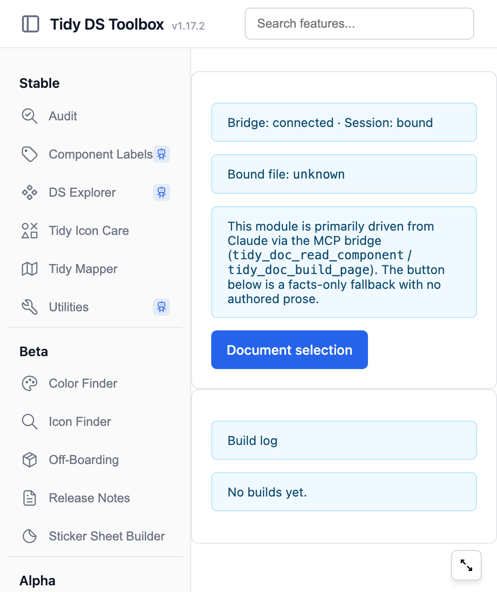

Build a Documentation Page for a component, from the component itself.

:::caution
Tidy Doc is alpha. The layout and the section set can change between releases.
:::

## What it does

Tidy Doc reads one component or component set, and it draws a documentation page on a new Figma page.

The page holds up to five section cards, in this order.

1. **Variants.** One block for each type of the component, with the words that describe it, and a picture of every state.
2. **Component Breakdown.** The measurements: height, width, and where the icon sits.
3. **Mode.** The component in each variable mode, side by side.
4. **Usage Guidelines.** When to use it, when not to, and the do and do not examples.
5. **Related Components.** The components near it, and when to use those instead.

A section with nothing to say is not drawn, so a simple component gets a shorter page.

Tidy Doc owns that page. It does not edit your component.

## Run it from Claude

Tidy Doc is the module where Claude does the most for you.
Claude reads the component, writes the prose, and then builds the page.

The panel has a button as well, and it writes **no prose**.
Read [The panel button](#the-panel-button) for when to use it.

### Before you start

- Read [Connect the plugin to Claude](/setup/connect-claude/).
- The Tidy DS Toolbox panel must be open in Figma.
- Select one component or one component set. Tidy Doc cannot run on a frame or a group.

### Steps

1. Select the component in Figma.
2. Run `/tidy-ds:tidy-doc` in Claude Code.
3. Wait. Claude reads the component, writes the words, and builds the page.
4. Read the page in Figma. That is the review, and there is no approval step before it.

```
/tidy-ds:tidy-doc
/tidy-ds:tidy-doc 2543:1881
/tidy-ds:tidy-doc status=REVIEWING
/tidy-ds:tidy-doc sections=variants,breakdown,related
/tidy-ds:tidy-doc dry-run=true
```

With no node id, Tidy Doc uses the current Figma selection.

### The arguments

| Argument | What it does |
| --- | --- |
| A node id, such as `2543:1881` | The component to document. Leave it out to use the selection. |
| `status=` | The status on the badge of the page. The default is `IDEATION`. |
| `sections=` | The sections to write. Give them as a list, from `variants`, `breakdown`, `mode`, `guidelines` and `related`. |
| `dry-run=true` | Writes the content, and does **not** build the page. Read it first, then run the command again to build. |

A section you ask for is still skipped if the component has no facts for it.

The status takes one of these values.

`IDEATION`, `in process`, `DESIGN COMPLETED`, `REVIEWING`, `DEV HAND-OFF`, `ON HOLD`, `CANCELED`, `LIVE`.

## What you get

A new Figma page, named after the component, so it sorts next to the component it describes.

A second run deletes the page from the run before it, and builds the page again.
So do not edit the generated page by hand. Your edit is lost on the next run.

## The words are written, the facts are not

This is the part to trust, so it is worth knowing how it works.

Claude writes the judgment: what a variant is for, when to use it, what not to do.

Claude does **not** write the facts.
The variant names, the measurements, the modes and the names of the related components are read from your component.
The build reads them again from the live component, and it refuses a name that does not exist there.

So the page cannot state a variant your component does not have, or a measurement nobody measured.

## The panel button

The panel has one button, **Document selection**.
It builds the same page shape, with the facts, and with no words at all.

Use it when you want the structure and the measurements, and you are content to write the words yourself.

1. Select the component on the canvas.
2. Open the panel, and select **Tidy Doc** in the module list, under **Alpha**.
3. Select **Document selection**.
4. Read the build log at the bottom of the panel. It names the page it built.



## When to use it

- A component is finished, and it needs a documentation page.
- A component changed, and its documentation page is now wrong.

## When not to use it

- The component is still changing shape. Build the page when the variants are settled.
- You want to keep documentation you wrote by hand on that page. Tidy Doc replaces the page it owns on every run.

## Limits

- The layout is one shape. There is no setting for another one, in the panel or in the command.
- The mode showcases stop at 8.
- One build at a time for each component. The panel says so if a build is already running, and it names whether the panel or Claude started it.
- The panel button writes no prose.

## Trouble

**The panel says a build is already running.** Wait for it to finish. The message names what started it.

**Nothing happens, and the panel stays busy.** Keep the Figma window in front. macOS slows a background window, and the plugin stops making progress.

**The page is missing a section you expected.** The section had nothing to draw. Check that the component has the variants or the variable modes that the section needs.

**Claude says the Bridge is disconnected.** The plugin is not open in Figma. Open it, and run the command again.

**The page has no prose.** It was built by the panel button. Run `/tidy-ds:tidy-doc` to get the words.
